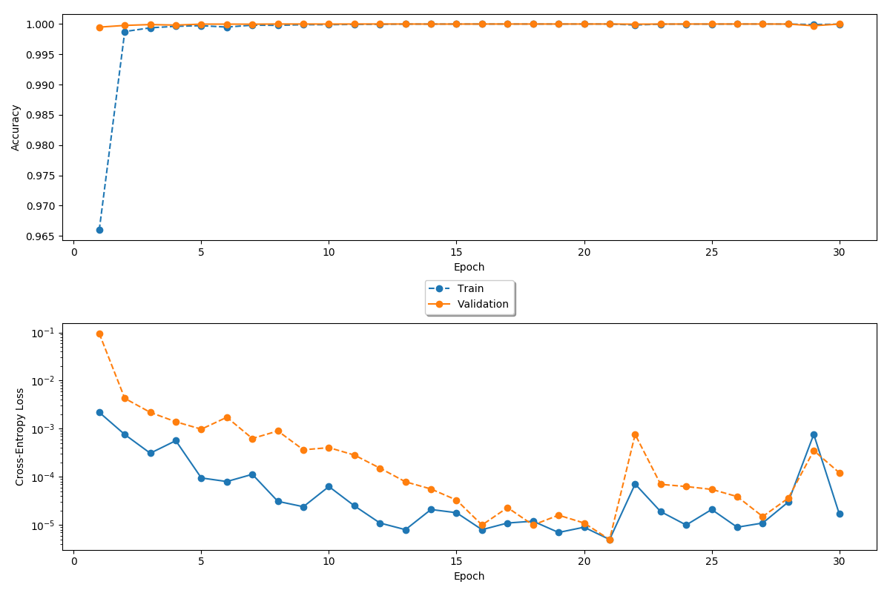

# plot_progress

Plot_progress takes training and validation accuracy and loss from a network/model log file and plots those values. The intention is to showcase the evolution of networks/models through data analysis. Comparison of accuracies will illustrate whether a network is underfitting or overfitting data, and offer next steps as to how it should be treated.

# Usage

```
plot_progress.py -h

Usage: plot_progress.py [-h] [-k POSITION] [-t] logfile

positional arguments:
  logfile     path of input file, e.g. ~/exps/resnet50/checkpoint/progress.log

optional arguments:
  -h, --help   show this help message and exit
  -k POSITION  add plot legend (Position: C,N,S,E,W,NW,NE,SE,SW)
  -t           add PyPlot interactive toolbar
```
### Position

Plot legend will be placed in one of 9 locations corresponding to the input supplied: "C" for Center, "N" for North, and so on.

# Plot Example


# License

MIT © Larry Pearlstein, Alex Benasutti

 


 
